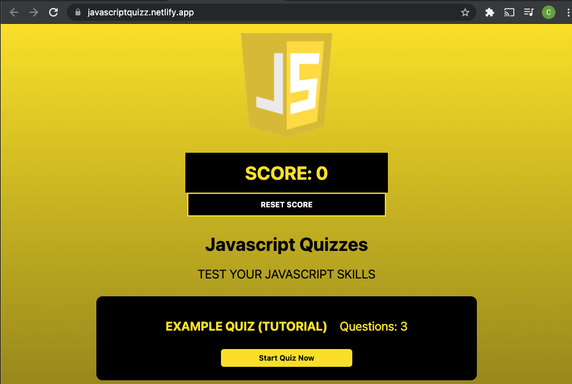

# Javascript Quiz app

## Design Screenshot

## Quiz App
This a basic quiz app with multiple quizzes that go over the topics surrounding Javascript and Computer Programing
To test how the the app works take the example test that has no infomation on Programming to see the functionality of the app. Check it out with the link below ⬇️ .

## Deployed application

Deployed Website Here: [Link](https://javascriptquizz.netlify.app/)

## How it works
First enter into one of the quizzes and be prompted with the first question. With each question you get right your score dynamically changes once you finish your quiz. To reset the score just click the reset Button to zero out your score.
